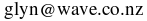

The |aw2c| Manual
*****************

|aw2c| is a new compiler for the Algol W language. It is intended to
be a correct and complete implementation of the language described in
the *Algol W Language Description*, June 1972.

|aw2c| should be able to compile code intended for the OS/360 Algol W
compilers and earlier versions of the MTS W compiler with little or no
modification. There may be some incompatibilities: |aw2c| appears
generates stricter run-time type-checks than previous compilers;
|aw2c| does not provide the MTS Algol's large collection of
MTS-specific I/O procedures; the more cunning methods of splitting
Algol W into separately compiled units will no longer work (but are no
longer necessary.)

|aw2c| uses `Gnu C`_ (with its `extensions`_) as an intermediate
language.  aw2c| is responsible for all parsing and compile-time and
run-time error checking, but it passes on the difficult task of
generating object code to *GCC*. *GCC* should be completely invisible
to the |aw2c| user, any messages from it whatsoever should be
considered to be bugs in |aw2c|.  This approach has the happy
side-effect of allowing Algol W programs to contain `inline C code`_
and to be linked with *GCC* object code.

Programs compiled by |aw2c| should be able to produce Algol W specific
error messages for all possible runtime errors.  A program created by
|aw2c| should never output C assertion errors or a core-dump.
See `ERROR MESSAGES`_.

.. Contents::

MAN PAGE
========

NAME
----

aw2c - compiler for the Algol W language

SYNOPSIS
--------

**algolw** *source.alw* *program*

**aw2c** [*source.alw*] [**-trace**] [**-o** *object.c*]

DESCRIPTION
-----------

|aw2c| implements the language described in *Algol W Language
Description, June 1972* very closely. |aw2c| allows Algol W programs
to contain `inline C code`_ and to be linked with **gcc** object code.  Read
the details in the |aw2c| manual: ``aw2c.html`` [this document].

COMMANDS
--------

**algolw** is the script for compiling single-source Algol W programs:

    **algolw** *source.alw* *program*

*source.alw* is Algol W program's source, *program* is the name for
the executable.  A *source.c* will be produces as a side-effect.

**aw2c** compiles Algol W programs into Gnu C (with its extensions):

    **aw2c** [*source.alw*] [**-trace**] [**-o** *object.c*]

If *source.alw* is left out the Algol W source is read from the standard input.
If **-o** *object.c* is left out the C source is written to the standard output.

**-trace** asks |aw2c| to insert `procedure call tracing code`_.

|aw2c| C code must be compiled with *gcc* and linked to the math,
*Boehm GC* and aw2c run-time libraries: ``-lm`` ``-lgc`` and ``-lalw``. [The
``-lalw`` flag has to appear after the object code files. I don’t know
why.]::

    aw2c main-program.alw -o main.c
    aw2c separate-procedure.alw -o procedure.c
    gcc main.c procedure.c other-stuff.o -lm -lgc -lalw -o program

AW2C and GCC
------------

|aw2c| uses `Gnu C`_ (with its `extensions`_) as an intermediate
language.  |aw2c| is responsible for all parsing, type checking and
compile-time error messages, but it passes on the difficult task of
generating object code to **gcc**. **gcc** should stay completely
invisible when you run algolw, any messages from **gcc** whatsoever
should be considered to be bugs in |aw2c|.

Programs compiled by |aw2c| should be able to produce Algol W specific
error messages for all possible runtime errors.  A program created by
|aw2c| should never output C assertion errors or a core-dump.
(However, if you include inline C code you are back on your own.)

PREREQUISITES
-------------

The *gcc* C compiler and ``libgc``, the Boehm GC library.

COPYRIGHTS
----------

The |aw2c| test suite contains *parser.alw*, a parser generator by
Hendrik Boom.  Otherwise, copyright 2008 by Glyn Webster.

|aw2c| is free software: you can redistribute it and/or modify it under
the terms of the GNU General Public Lesser GNU General Public licenses
as published by the Free Software Foundation, either version 3 of the
License, or (at your option) any later version.

FILES
-----

::

 /usr/local/bin/aw2c
 /usr/local/bin/algolw
 /usr/local/lib/libalw.a
 /usr/local/include/alw.h

SEE ALSO
--------

::

 gcc(1)
 /usr/local/share/doc/aw2c/aw2c.html
 /usr/share/doc/libgc-dev or <http://www.hpl.hp.com/personal/Hans_Boehm/gc/>

AUTHOR
------

Glyn Webster

LANGUAGE IMPLEMENTATION
=======================

The following describes |aw2c|'s implementation of Algol W, compared to
'The Algol W Language Description', June 1972, and what I know of the
original ALGOLW or XALGOLW compilers.

Incompatibilities 
-----------------

(These will certainly break some existing programs.)

- |aw2c| cannot infer a procedure parameter's formal parameter list;
  it requires explicit `formal parameter declarations for procedure parameters`_.

- The transfer functions `BASE16 and LONGBASE16`_ return strings in a
  different format.

- ``NOT`` is a reserved word. This is a feature of **MTS Algol W** syntax.

Big Differences
---------------

(These might break existing programs.)

- `Latin-1/IBM1047 Character Encoding`_. Strings are stored in the
  computer's native character set, typically Latin-1, but Algol W
  string operations still happen in EBCDIC. The EBCDIC character set
  is IBM1047.

- Arithmetic is performed to the computer's native processor rules,
  typically IEEE 754, not System/360 rules. In particular, the
  domains of the standard functions of analysis will have changed.

- The UNFL and OVFL exceptional conditions are not fully implemented.

- The run-time type tests for reference values seem to be stronger than those
  generated by the original ALGOLW and XALGOLW compilers.  Some
  reference declarations may have to be made more inclusive.
 
- The `Input/Output System`_ uses the Unix standard input and output
  streams as its card reader and printer, its default configuration has
  been changed sightly to suit stream I/O better. Run-time error
  messages are printed on the standard error stream.

- All **ALGOLW** "compiler directive" lines are silently ignored. 

- `External procedures`_ are linked according to *gcc*'s rules,
  regardless of language, and must use |aw2c|'s calling conventions

Little Differences
------------------

(These should not break existing programs.)

- Short and long numeric types are identical, both are equivalent to
  C's *double* type.

- *Name* parameters can always be assigned to, even if their actual
  parameters are expressions. There is no run-time error.

- `Run-time error messages`_ are formatted differently.  

- All variable quantities are initialized to ``0``, ``#0``, ``NULL``,
  ``""`` or ``FALSE``.

Extensions
----------

(These should not break existing programs.)

- The Algol W source code "hardware representation" is
  case-insensitive Latin-1 text.

- String constants may contain any Latin-1 or IBM1047 printable
  character, not just those listed in Apendix A of *Algol W Language
  Description*.

- A program block may return an integer. The integer will be returned
  to the operating system as an exit code.

- `Inline C code`_. 

- In references to `external procedures`_ any identifier may appear in
  the place of the ALGOL or FORTRAN keywords.

- The `Input/Output System`_ is relaxed about input record lengths.

- The Input/Output System system's "printer" is reconfigurable. There
  is an extended set of `IOCONTROL control codes`_ for reconfiguring
  the printer.

- The `TIME procedure`_ has additional control codes to allow finer
  measurements.

- Some **MTS Algol W** syntax is allowed:

  - ``~`` or ``NOT`` may be used in place of ``¬``.

  - Short comments.
    *"Comments may be written in a brief form by using the percent sign,
    ``%``, to indicate both the start and the end of a comment. Comments
    which start with percent may also be ended with a semicolon."*

  - Sequences of strings are concatenated.
    ``"string" "string"`` = ``"stringstring"``

- `Block comment directives`_.
  

Backward compatibilities
------------------------

(These are some things that some Algol W compilers allowed that are not
part of the language.)

- `Empty arrays`_ (arrays with no elements.)

- The WRITECARD standard procedure (a feature of MTS Algol W.)

- LOGICAL values may appear in <relation> expressions.  TRUE > FALSE.

- `WRITE can write REFERENCE values`_ for debugging purposes. (a feature
  of OS/360 Algol W.)

LANGUAGE EXTENSIONS
===================

(These extensions have only been included because they turned out to
be necessary. The language implemented by |aw2c| is *not* meant to be
a superset of Algol W.)

Formal parameter declarations for procedure parameters
------------------------------------------------------

|aw2c| requires procedure parameters to have explicitly declared
formal parameter lists of their own. 

[This is painfully incompatible with *The Algol W Language
Description*, but it became necessary because of the way |aw2c| was
implemented. It could be seen as an improvement to Algol W, but that
was not the intention.]

Syntax
~~~~~~
In section 5.3.1 of the *Algol W Language Reference*, replace the
<formal parameter segment> and <formal type> rules with these::

    <formal parameter segment> ::=
          <formal type> <identifier list>
       |  <formal array parameter>
       |  <formal procedure parameter>

    <formal type> ::=
          <simple type>
       |  <simple type> "value"
       |  <simple type> "result"
       |  <simple type> "value" "result"

and add this rule::
    
    <formal procedure parameter> ::=
          <simple type> "procedure" <identifier list>
       |  "procedure" <identifier list>
       |  <simple type> "procedure" <identifier list> '(' <formal parameter list> ')'
       |  <"procedure" <identifier list> '(' <formal parameter list> ')'

Semantics
~~~~~~~~~
Note that paragraph 7.3.2.1, "Actual-formal correspondence", applies
in turn to the replaced procedure parameters when the body of the
procedure is expanded.  The paragraph implies that procedure
parameters have formal parameters of some sort, the syntactic
extensions above makes them explicit.

|aw2c| requires that actual and formal procedure parameters have
identical "procedure types." The `<formal parameter list>` of the
declaration of the actual parameter must by identical to the `<formal
parameter list>` of the formal parameter after all identifiers have
been removed from both.

The identifiers in the `<formal parameter list>` of a `<formal procedure
parameter>` merely indicate the positions of parameters, they serve no
other purpose.

A `<formal procedure parameter>` without a `<formal parameter list>`
declares a procedure parameter without parameters, its actual
parameter may be a `<statement>` or `<expression>`.

Examples
~~~~~~~~
::

  REAL PROCEDURE sum ( INTEGER VALUE first, last; 
                       REAL PROCEDURE f (INTEGER VALUE i) );
  
  REAL PROCEDURE f ( REAL PROCEDURE g, h (REAL a); 
                     REAL ARRAY a, b (*,*) );
  
  REAL PROCEDURE f (REAL PROCEDURE g (INTEGER PROCEDURE h (INTEGER i)));
  
  REAL PROCEDURE f (PROCEDURE statement);

  REAL PROCEDURE f (INTEGER PROCEDURE expression);

.. _`Empty arrays`:

Empty arrays
------------

If an array has a bound pair where the upper bound is one less than
the lower bound it is an "empty array", it contains no elements. Any
attempt to access an element of such an array is an error.

(Hendrik Boom says this was a useful undocumented feature of
the OS/360 Algol W compilers' implementation of Algol W.)

Examples
~~~~~~~~
::

    real array (0::-1);
    integer array (1::0, 1::2);

Latin-1/IBM1047 Character Encoding
----------------------------------

`Strings`_ are stored internally in the ISO 8859-1 (Latin-1) character
set. The `Input/Output System`_ reads and writes Latin-1.

DECODE, CODE and string comparisons transliterate Latin-1 character
codes into *IBM1047*, an extended version of EBCDIC that includes all
the characters of Latin-1. This is to prevent programs that relied on
EBCDIC codes from breaking.

See also: `Character codes and string order`_

IBM1047:

 ====== ====== ====== ====== ====== ====== ====== ====== ====== ====== ====== ====== ====== ====== ====== ====== ====== 
   \+     00     01     02     03     04     05     06     07     08     09     0A     0B     0C     0D     0E     0F  
 ====== ====== ====== ====== ====== ====== ====== ====== ====== ====== ====== ====== ====== ====== ====== ====== ====== 
 **00**   00     01     02     03     9C     09     86     7F     97     8D     8E     0B     0C     0D     0E     0F  
 **10**   10     11     12     13     9D     85     08     87     18     19     92     8F     1C     1D     1E     1F  
 **20**   80     81     82     83     84     0A     17     1B     88     89     8A     8B     8C     05     06     07  
 **30**   90     91     16     93     94     95     96     04     98     99     9A     9B     14     15     9E     1A  
 **40**          A0      â      ä      à      á      ã      å      ç      ñ      ¢      .      <      (     \+      |  
 **50**    &      é      ê      ë      è      í      î      ï      ì      ß      !      $     \*      )      ;      ^  
 **60**   \-      /      Â      Ä      À      Á      Ã      Å      Ç      Ñ      ¦      ,      %      _      >      ?  
 **70**    ø      É      Ê      Ë      È      Í      Î      Ï      Ì      \      :      #      @      '      =      "  
 **80**    Ø      a      b      c      d      e      f      g      h      i      «      »      ð      ý      þ      ±  
 **90**    °      j      k      l      m      n      o      p      q      r      ª      º      æ      ¸      Æ      ¤  
 **A0**    µ      ~      s      t      u      v      w      x      y      z      ¡      ¿      Ð      [      Þ      ®  
 **B0**    ¬      £      ¥      ·      ©      §      ¶      ¼      ½      ¾      Ý      ¨      ¯      ]      ´      ×  
 **C0**    {      A      B      C      D      E      F      G      H      I      ­      ô      ö      ò      ó      õ  
 **D0**    }      J      K      L      M      N      O      P      Q      R      ¹      û      ü      ù      ú      ÿ  
 **E0**    \      ÷      S      T      U      V      W      X      Y      Z      ²      Ô      Ö      Ò      Ó      Õ
 **F0**    0      1      2      3      4      5      6      7      8      9      ³      Û      Ü      Ù      Ú     9F  
 ====== ====== ====== ====== ====== ====== ====== ====== ====== ====== ====== ====== ====== ====== ====== ====== ====== 

The hexadecimal numbers are codes for non-printing Latin-1 characters. 

Block comment directives
------------------------

All source code lines between the directives ``@AW2C_TEXT`` and
``@AW2C_CODE`` will be ignored by |aw2c|.  This allows long comments
containing semicolons to appear in |aw2c| source code, it also allows
chunks of Algol W code to be commented out while debugging.

Directives must start in the first column of a line. 

Example
~~~~~~~

A block comment::

    @AW2C_TEXT
    I'm leaving this procedure out for now; I don't need it:

    INTEGER PROCEDURE triangle (INTEGER VALUE i);
    BEGIN
        (i**2 + i) / 2
    END;
    @AW2C_CODE

STANDARD PROCEDURES
===================

There are small extensions to some of Algol W's standard procedures,
and one alteration (real number to base 16 transfer functions).

- There is an implied decimal place in the string encoding format of
  BASE10 and LONGBASE10. For example::

     LONGBASE10(123.456789012345) = " +02+123456789012345"

  Such a result can easily be rearranged using substrings. [I think
  this is what was intended. If I've made the wrong assumption,
  please tell me.]

- If the exponent part of a real number is 3 digits long the BASE10 or
  LONGBASE10 string encoding format becomes::

     ±EEE±DDDDDDDDDDDDDDD

- _`BASE16 and LONGBASE16` return 24 character wide fields in GNU C's
  ``%a`` printf format.

  [Algol W programs have no way to read the *Algol W Language
  Description*'s base 16 format for REAL numbers, nor does any
  existing Unix program I know of, so there didn't seem much point in
  implementing them in the way described.]

- The _`TIME procedure` has additional control codes to allow finer measurements:

  =====  ======================  ========
  code   result                  units
  =====  ======================  ========
  10000  elapsed execution time  "clocks"
  10001  CLOCKS_PER_SEC
  =====  ======================  ========

  ``CLOCKS_PER_SEC`` is the constant defined in the C header
  ``<time.h>``.  ``TIME(10000) / TIME(10001)`` will be the elapsed
  execution time in seconds, represented as a REAL. The GNU C manual
  says that ``TIME(10000)`` will "wrap around" in roughly 72 minutes
  on a machine with ``CLOCKS_PER_SEC`` set to 1000000.

- *Elapsed execution time* means the time the program's process has
  used on the CPU.

- IOCONTROL. There are additional `IOCONTROL control codes`_.

Input/Output System
-------------------

The Input/Output System is an extention of the one described in the
June 1972 `Algol W Language Description`. The Unix standard output
stream represents the printer, lines from standard input represent
card reader input records.

The Input/Output System is reconfigurable. The initial configuration
handles whitespace and page breaks in a relaxed way that better suits
stream I/O, this should not effect most programs.  The Input/Output
System can be returned to strict `Algol W Language Description`
behaviour by setting `IOCONTROL control codes`_ or Unix environment
variables.

- WRITE does not print spaces at the ends of lines or eject the last
  page by default, see the *trim lines* and *eject last page*
  IOCONTROL control codes below.

- _`WRITE can write REFERENCE values`. REFERENCE values have the syntax::

        'null'
 
  or::

        <identifier> '.' <integer>

  where `<identifier>` is a record's class and `<integer>` is the
  record's *allocation number*. Allocation numbers are assigned to
  records from a counter that is incremented every time a record is
  allocated. Predeclared records have negative allocation numbers. 
  The variable I_W controls the field width.

  (Hendrik Boom says this was a useful undocumented feature of
  **ALGOLW**'s implementation of Algol W. 

- Negative numbers in I_W or R_W cause output fields to be right
  adjusted.

- WRITECARD writes strings as individual lines of characters.

- READ pays no attention to the length of input records.

- READ allows ``e`` to be used in place of ``'`` in REAL constants.

- READCARD reads lines of characters into strings, not fixed-length
  cards. If a line contains more characters than a READCARD actual
  parameter can hold, the excess characters will be ignored. If the
  line is shorter than the string, the string parameter will be padded
  with spaces.

IOCONTROL control codes
~~~~~~~~~~~~~~~~~~~~~~~

IOCONTROL has extended control codes, mostly to modify the
Input/Output System configuration. The configuration can also be set
by Unix environment variables.

  =========  ===========================   =============   ========================  
  code       meaning                       default         environment variable      
  =========  ===========================   =============   ========================  
      ``4``  hard page breaks = *on*        off            ``ALW_HARD_PAGE_BREAKS``    
      ``5``  hard page breaks = *off*                                                
  ``1dddd``  output page width                132          ``ALW_PAGE_WIDTH``          
  ``2dddd``  output page height               60           ``ALW_PAGE_HEIGHT``         
  ``3dddd``  output page estimate           *unlimited*    ``ALW_PAGE_ESTIMATE``       
  ``40001``  reset page and line count                                               
  ``40002``  unconditional line break 
  ``40004``  pretty page breaks = *off*        off          ``ALW_PRETTY_PAGE_BREAKS``  
  ``40005``  pretty page_breaks = *on*                                           
  ``40006``  strict line breaks = *off*        off          ``ALW_STRICT_LINE_BREAKS``  
  ``40007``  strict line breaks = *on*                                           
  ``40008``  trim lines  = *off*               on           ``ALW_TRIM_LINES``  
  ``40009``  trim lines = *on*                                           
  ``40010``  eject last page = *off*           off          ``ALW_EJECT_LAST_PAGE``
  ``40011``  eject last page = *on*
  =========  ===========================   =============   ========================  

  ``dddd`` stands for the digits of a numeric setting, where "9999" means
  *unlimited*.

  *Output page height*
    is the number of lines per page.  

  *Output page estimate* 
    is the number of pages the program may output. "0" means *no
    output.* [This prevents your computer centre being flooded with
    fan-fold paper, I suppose.]

  *Hard page breaks* 
     replace the last line feed of a page with a form feed (^L) or
     write a *pretty page break.* The correct `Algol W Language
     Description` default is *on*, but *off* suits stream output
     better.

  *Unconditional line break* 
     write a line break immediately, even if nothing has been writen
     to the line.

  *Pretty page breaks* 
     means rule across the page with "~" signs at the end of a page, rather
     than issue a form feed code.
  
  *Strict line breaks* 
     means raise a run-time error if a WRITE field is wider than the
     output page width.

  *Eject last page* 
    means perform a page break at the end of the program.  If this is
    *off* a line break is performed instead. The correct `Algol W
    Language Description` behaviour is to eject the last page, but a
    mere line break suits stream output better.
  
  *Trim lines* 
    means do not print spaces at the end of a line. The last WRITE
    field on a line may contain spaces on its right-hand side, but
    actually writing them to the line does not suit stream I/O - it
    can be very ugly and confusing.

.. _`ERROR MESSAGES`:

ERROR MESSAGES
==============

|aw2c| compiler and run-time error messages are generally more specific
than their OS/360 compiler equivalents, except for syntax errors. 

Error messages are preceded by the position of the error in the Algol
W source file:

  <source-file-name>:<line>:<column>: 

(This is format used by *gcc*. Emacs likes it.)

Compile-time errors
-------------------
Compile-time errors should only come from |aw2c|.  Any *gcc* error message
should be considered to be a bug in the compiler, |aw2c| uses *gcc* purely
as an object code generator and linker.

Run-time error messages
-----------------------

Run-time error messages are sent to "stderr". 

A program created by |aw2c| should be emit a run-time error
message for every run-time error that the Algol W language allows. If
you see C assertion errors or core-dumps assume they are caused by
bugs in the |aw2c| compiler, not by bugs your Algol W program. (But
all bets are off for Algol W programs that include `C language source code`_.)

[These are subject to change. Use ``grep 'alw_(error|warning)' *.c`` in
the |aw2c| source directory to locate all run-time error messages.]

Miscellaneous:
    - assertion failure
    - FOR step of 0
    - CASE range error: selector was %d
    - negative shift operand to SHL
    - negative shift operand to SHR

Records:
    - reference error: tried to find field %s of a NULL reference
    - reference error: tried to find field %s of a REFERENCE(%s)
    - reference error: %s cannot be made to refer to a '%s' record.
    - Cannot allocate this record: Out of memory!

Strings:
    - Tried to copy invalid substring (%d|%d).
    - Tried to copy substring (%d|%d) of a string of length %d.
    - Tried to assign to invalid substring (%d|%d).
    - Tried to assign to substring (%d|%d) of a string of length %d.
    - Expected this string's length to be %d, it is %d.
    - array subscript error: subscript %d of '%s' = %d, outside the range (%d::%d)
    - array bounds error: bound %d of '%s' is (%d::%d) here, %d > %d

I/O System:
    - Expected an integer between %d and %d in system variable %s.
    - Expected a true or false value in system variable %s.

    - Expected to read %s on line %d of %s; found %s.
    - The page estimate is 0 pages, nothing should be written.
    - A WRITE field was too wide for the page here.
    - The page estimate, %d pages, has been reached.
    - R_FORMAT = \"%s\", this is not a valid format code.
    - IOCONTROL code %d is undefined.

The default "exceptional condition" messages:
    - Floating-point exponent overflow.
    - Floating-point division by zero.
    - Integer overflow.
    - Integer division by zero.
    - Negative argument for SQRT or LONGSQRT.
    - Argument of EXP or LONGEXP out of domain.
    - Argument of LN, LOG, LONGLN or LONGLOG out of domain.
    - Argument of SIN, COS, LONGSIN or LONGCOS out of domain.
    - Unexpected end of input.

.. _`C language source code`:

INTERFACING ALGOL W WITH C
==========================

Identifiers
-----------

|aw2c| treats Algol W identifiers as case-insensitive. They are always
converted to lowercase C identifier. (But see `External procedures`_ below.)

An underscore is secretly appended to Algol W identifiers that are Gnu
C reserved words, ``argc``, ``argv``, or Algol W predeclared function
names that clash with C standard library names (``time``, ``round``
and ``odd``.) For a full list search for "gnuc_keywords" in
"codeGen.ml".

Examples
~~~~~~~~

   ==================    =============
   Algol W identifier    C identifier
   ==================    =============
   ``x15``               ``x15``
   ``NEW_PAGE``          ``new_page``
   ``ElderSibling``      ``eldersibling``
   ``const``             ``const_``
   ``SWITCH``            ``switch_``
   ``argc``              ``argc_``
   ``time``              ``time_``
   ==================    =============

Sacred identifiers
~~~~~~~~~~~~~~~~~~

The procedures and variables of |aw2c|'s run-time library begin with
the prefix ``alw_``; temporary variables inserted by |aw2c|'s code
generator start with underscores. Avoid using such identifiers
whenever possible.

Source code locations
---------------------

The C type ``alw_loc`` represents locations in the original Algol W source code.
``alw_loc`` values are passed to run-time library functions that can
raise run-time errors. In inline C code ``alw_loc`` arguments should
always by passed the macro ``alw_HERE``.

Simple Types
------------

The C type equivalents of the Algol W simple types:

    ==================  ===================  ===============================
    simple type         C type               preconditions
    ==================  ===================  ===============================
    ``INTEGER``         ``int``
    ``REAL``            ``double``
    ``LONG REAL``       ``double``
    ``COMPLEX``         ``_Complex double``  
    ``LONG COMPLEX``    ``_Complex double``
    ``LOGICAL``         ``int``               
    ``BITS``            ``unsigned int``
    ``STRING(1)``       ``alw_chr``
    ``STRING(n)``       ``alw_str``          x != NULL
    ``REFERENCE(...)``  ``void *``           x == NULL or points to a record
    ==================  ===================  ===============================

The LOGICAL FALSE value is 0, all other values are TRUE, as in C.

The NULL reference is represented by ``(void *)0``. (C's NULL macro is
not available to inline C code unless ``stdlib.h`` is imported.)

Strings
-------

A2WC represents STRING(1) as ``unsigned char``::

    typedef unsigned char alw_chr;

Strings longer that one character are represented by pointers to
mutable character arrays::

    typedef alw_chr *alw_str;

The type of strings longer that one character is referred to as
"STRING(n)" in the manual.

STRING(n) variables are typically declared like this: ``alw_chr x[n];``

The |aw2c| run-time library contains string manipulation functions,
these have the prefix ``alw_str_``.  Some of these functions have ``_c``,
``_sc``, ``_cs`` and ``_cc`` suffixes, these are versions that take
``alw_chr`` arguments.

Allocating, copying and returning strings
~~~~~~~~~~~~~~~~~~~~~~~~~~~~~~~~~~~~~~~~~

This fills a string array with spaces::

    void alw_str_init (alw_str dst, int dstlen);

These allocate a copy of an existing string, padded to the correct
length with spaces::

    alw_str alw_str_new   (const alw_str src, int srclen, int dstlen);
    alw_str alw_str_new_c (const alw_chr src, int dstlen);

They *must* be used on strings that are about to be returned from
procedures. The ``src`` argument may be a C string.

These copy one string into another, in place. They are for performing
assignments to STRING(n) variables::

    alw_str alw_str_cpy    (alw_str dst, int dstlen, const alw_str src, int srclen);
    alw_chr alw_str_cpy_sc (alw_str dst, int dstlen, alw_chr src);

Substrings
~~~~~~~~~~

Substrings are pointers into STRING(n) character arrays.

This function returns a pointer to a substring::

   alw_str alw_str_sub (alw_loc loc, const alw_str src, int srclen, int index, int length);

There is a runtime error if the substring is not completely in the
bounds of the string.  ``alw_str_sub`` is used to find both STRING(1)
and STRING(n) substrings. The result of the call ``alw_str_sub(loc, src,
n, m, 1)`` should treated as a pointer to ``alw_chr``.

Character codes and string order
~~~~~~~~~~~~~~~~~~~~~~~~~~~~~~~~

Characters are encoded in Latin-1. However, Algol W's standard string
functions transliterate character codes into IBM1047 EBCDIC. CODE accepts
EBCDIC codes, DECODE returns EBCDIC codes, and string comparisons are
done in EBCDIC order. See `Latin-1/IBM1047 Character Encoding`_

Programs that use strings as packed arrays of bytes should define
their own un-transliterated byte-access procedures. See the example
``raw_decode`` in the `External procedures`_ section below.

These are Algol W's standard EBCDIC code/decode functions::
     
    alw_chr code (int ebcdic);

    int decode (alw_chr string1);

These are the string comparison functions::

    int alw_str_cmp ( const alw_str str1, int str1len, 
                      const alw_str str2, int str2len );

    int alw_str_cmp_sc ( const alw_str str1, int str1len, 
                         alw_chr s2 );

    int alw_str_cmp_cs ( alw_chr s1, 
                         const alw_str str2, int str2len );

    int alw_str_cmp_cc (alw_chr s1, alw_chr s2);

The transliteration tables are::

   alw_chr alw_latin1_to_ebcdic[256];
   alw_chr alw_ebcdic_to_latin1[256];

Arrays
------

Algol W arrays are translated into C functions that return pointers
to array elements:

    =============================  ===========================
    Algol W array                  C function
    =============================  ===========================
    ``T ARRAY a (l0::h0)``         ``t *a(alw_loc, int)``
    ``T ARRAY a (l0::h0,l1::h1)``  ``t *a(alw_loc, int, int)``
    *etc.*
    =============================  ===========================

(where ``T`` is an Algol W simple type and ``t`` its C equivalent.)

Array functions can raise "Subscript out of range" run-time errors.

The inline C version of the array assignment ``a(1,2) := b(3)`` should
be ``*a(alw_HERE, 1, 2) = *b(alw_HERE, 3)``.  

The actual C array that stores the elements of an array variable ``a``
will be called ``_array_a``. But use the array element pointer functions
unless you are feeling really keen.

Records
-------

A record designator is translated into a C function that takes a
default value argument for each field and returns a pointer to a newly
created record structure.

A record field becomes a function that takes a pointer to a record and
returns a pointer to the field's value.:: 

    RECORD r (T0 f0, T1 f1,...);

creates C functions with these prototypes::

    void *r (t0, t1, ...);
    t0 *f0 (alw_loc, void *);
    t1 *f1 (alw_loc, void *);
    ...

(where ``T`` is an Algol W simple type and ``t`` its C equivalent.)

Field functions can raise run-time reference type errors.

References are represented by ``void *`` pointers. Reference pointers
must either be NULL or be pointers returned by a record designator
function: RECORD structures contain hidden fields that determine their
class at run-time.

This macro accesses the name of a reference's class::

    const char *alw_class(void *reference);

Formal parameters to procedures
-------------------------------

The equivalents of Algol W formal parameters (except STRING(n) parameters):

    ====================  ==============================
    formal parameter      C function argument
    ====================  ==============================
    ``T VALUE x``         ``t x``
    ``T RESULT x``        ``t *x``
    ``T VALUE RESULT x``  ``t *x``
    ``T x``               ``t *(*x)(void)``
    ``T PROCEDURE x``     ``t x(void)``
    ``PROCEDURE x``       ``void x(void)``
    ``T ARRAY x (*)``     ``t *(*x)(alw_loc, int)``
    ``T ARRAY x (*,*)``   ``t *(*x)(alw_loc, int, int)``
    *etc.*
    ====================  ==============================

(where ``T`` is an Algol W simple type and ``t`` its C equivalent.)

RESULT parameters become pointers to values, Name and ARRAY parameters
become functions that return pointers to values.

All STRING(n) VALUE/RESULT parameters are represented by ``alw_str``,
i.e. pointers to character arrays:

    =============================  =====================================
    formal parameter               C function argument
    =============================  =====================================
    ``STRING(n) VALUE x``          ``alw_str x``
    ``STRING(n) RESULT x``         ``alw_str x``
    ``STRING(n) VALUE RESULT x``   ``alw_str x``
    ``STRING(n) x``                ``alw_str (*x)(void)``
    ``STRING(n) PROCEDURE x``      ``alw_str x(void)``
    ``STRING(n) ARRAY x (*)``      ``alw_str (*x)(alw_loc, int)``
    ``STRING(n) ARRAY x (*,*)``    ``alw_str (*x)(alw_loc, int, int)``
    *etc.*
    =============================  =====================================

When a procedure is called from within Algol W code, RESULT parameters
will point to copies of their actual parameters. The copies are
assigned back to the actual parameters after the procedure
returns. This copying is done at the point-of-call, so when the same
function is called from within C code its RESULT parameters will point
directly to their actual parameters.

Inline C code
-------------

|aw2c| allows inline C code. Inline C is dropped into |aw2c|'s C
code output wherever it appear in the Algol
W source. (Whether the inline C is correct is left for *gcc* to decide.)

There are additional syntactic rules for inline C code. <C code> is
the only new syntactic entity::

  <C code> ::= '{' <C-like text> '}'

  <C-like text> ::= <C-like text> <C string>  
                 |  <C-like text> <C comment>  
                 |  <C-like text> '{' <C-like text> '}'  
                 |  <C-like text> <character>  
                 |  <empty> 

The first character after the '{' will always be in column 1 of the C
code output. (This lets C directives come out right.)
     
Inline blocks of C statements::

  <statement> ::= <C code> 

Inline C expressions::

  <T expression> ::= '(' <simple type> ')' <C code> 

The <C code> contains the C expression, the <simple type> its Algol W
type (|aw2c| cannot infer this).

A C declaration block::

   <declaration> ::= '*' <C code>

There may be any number of C declarations in the <C code> block.  The
declarations will be visible inside other C code blocks, but not visible 
to Algol W code.  C functions can be made visible to Algol W by declaring
them as `external procedures`_.

A program may optionally start with a C declaration block, which may
include ``#include`` directives::

   <program> ::= '*' <C code> ';' <program>

Here is tiny example::

  *{
  #include <stdio.h>    
  #define USE_TWO
  };
  begin
     *{int i;}
     integer j;
     j := 1;
     {i = 0xff;};
     {#ifdef USE_TWO};
        j := 2;
     {#else};
        j := (integer){i % 5};
     {#endif};
     { printf("%03d,%03d\n", i, j); /* so, what do those look like? */ }
  end.
  ----stdout
  001,002
  ----end

Function procedures must end with expressions, Algol W type-checking
requires this. If you want a function procedure to return from within
a C statement, supply a dummy expression. For example::

  INTEGER PROCEDURE power_of_two (INTEGER VALUE i);
  BEGIN
     { return 1 << i; };
     0
  END;

External procedures
-------------------

An "external procedure" is any procedure defined outside of a
program's Algol W source.  (See "5.3.2.4 External references".) An |aw2c|
external procedure can be a separately compiled procedure, a C
function defined inside <C code> or a C macro.

All external procedures must use the C calling conventions outlined
above.  (Including Fortran subroutines. See the *gcc* Fortran manuals
for details.)

The syntax of external references has been changed to this::

    <external reference> ::= <identifier> <string>

<identifier> is: 

- ``auto``, for a Gnu C `nested functions`_ declared in the same Algol W block.

- ``macro``, for a C macro;

- any other identifier is for a separately compiled or non-nested procedure
  (``algol``, ``fortran``, or ``C`` are good choices for this identifier.)

<string> is:

- a C ``#define`` statement for a "macro" procedure declaration;

- empty, if the external procedure has the same identifier as the one
  used in the procedure declaration;

- any valid C identifier, use this for external procedure names that
  contain uppercase characters or leading underscores.

The file "alw.h" contains prototypes for |aw2c|'s run-time functions,
this can be included into source files for separately compiled
external C functions.

Examples::

  procedure dater (integer value key, pr; string(12) result date);
     c_plus_plus "get_date";
     % Here we assume that "get_date" will be linked into the program
       later, and note that it will probably be a C++ function. %

  integer procedure raw_decode (string(1) value c); 
      macro "#define raw_decode(c) ((int)c)";

  begin
     integer procedure rnd(integer value low, high); 
        auto "";

     *{ auto int rnd (int low, int high) 
        {
           assert(low <= high);
           return low + random(high - low);
        }
     };
     ...
  end

  *{
  #include <stdio.h>
  #include <string.h>
  #include <assert.h>
  alw_str octal (int i)
    {
      char buffer[25];
      sprintf(buffer, "%24o", i);
      assert(strlen(buffer) <= 24);
      return alw_str_new(buffer, strlen(buffer), 24);
    }
  };
  begin
     string(24) procedure octal (integer value x); C "";
     write(octal(12345))
  end.

Procedure call tracing code
---------------------------

The **-trace** option asks |aw2c| to insert hooks for tracing or
profiling procedure calls. The programmer must provide his own
definitions for these hooks. 

The programmer must provide these C functions::

  void alw_trace_procedure_called  (alw_loc call_loc, const char *procedure_name);

  void alw_trace_procedure_entered (alw_loc procedure_loc, const char *procedure_name);

  void alw_trace_procedure_exited  (alw_loc call_loc, const char *procedure_name);

- ``alw_trace_procedure_called`` is called before a procedure is called;
- ``alw_trace_procedure_called`` is called after a procedure is called, from within the procedure;
- ``alw_trace_procedure_entered`` is called after the procedure has been returned from.

``call_loc`` will be the location of the procedure call. ``procedure_loc``
is the location of the procedure's definition. ``alw_trace_procedure_exited`` 
will not be called if the procedure is exited via a ``GOTO`` statement.

[I'm not sure how adequate this set of hooks is. ]

THE TEST SUITE
==============

The script "testprograms.ml" in the |aw2c| source compiles runs a whole
directory of Algol W programs, checking them against their test suite
data.  "testprograms.ml" is used to check |aw2c|'s big wonky test suite,
which can be found in the directory "Tests".

|aw2c| ignores everything in a source file after the program's final
full-stop. Test suite data is placed after that full-stop.  The format
is:

|    ``----stdin``
|      (Text to place on the standard input stream.)
|    ``----compile``
|      (Expected output from the |aw2c| or *gcc* compilers.)
|    ``----stdout``
|      (Expected output from the program on the standard output stream.)
|    ``----stderr``
|      (Expected output from the program to the standard error stream.)
|    ``----exitcode``
|      (The program's expected exit code.)
|    ``----end``

Any deviation from the text in the expected output sections fails the
program.

These sections must appear in order, but any section is optional.
The default for an empty section is to expect no output, except for
the ``exitcode`` section, it defaults to 0.

Copyrights
==========

**Intention:** |aw2c| is to be open source; |aw2c|'s run-time library may
be compiled into any program; the fish is *mine*.

The |aw2c| test suite contains ``parser.alw``, a parser generator by
Hendrik Boom, it remains copyright to its author.  Otherwise,
Copyright 2008 by Glyn Webster.

|aw2c| is free software: you can redistribute it and/or modify it
under the terms of the GNU General Public and Lesser GNU General
Public licenses as published by the Free Software Foundation, either
version 3 of the License, or (at your option) any later version.

aw2c is distributed in the hope that it will be useful,
but WITHOUT ANY WARRANTY; without even the implied warranty of
MERCHANTABILITY or FITNESS FOR A PARTICULAR PURPOSE.  See the
GNU General Public License for more details.

You should have received a copy of the GNU General Public
License along with aw2c.  If not, see <http://www.gnu.org/licenses/>.

The aw2c-fish logo is not covered by the GNU General Public Licences,
it is simply copyright to Glyn Webster, 2008.

.. |aw2c| replace:: **aw2c**

.. _`Gnu C`: http://gcc.gnu.org/
.. _`extensions`: http://gcc.gnu.org/onlinedocs/gcc/C-Extensions.html
.. _`nested functions`: http://gcc.gnu.org/onlinedocs/gcc/Nested-Functions.html
.. _`Algol W Language Description`: algolw.pdf

